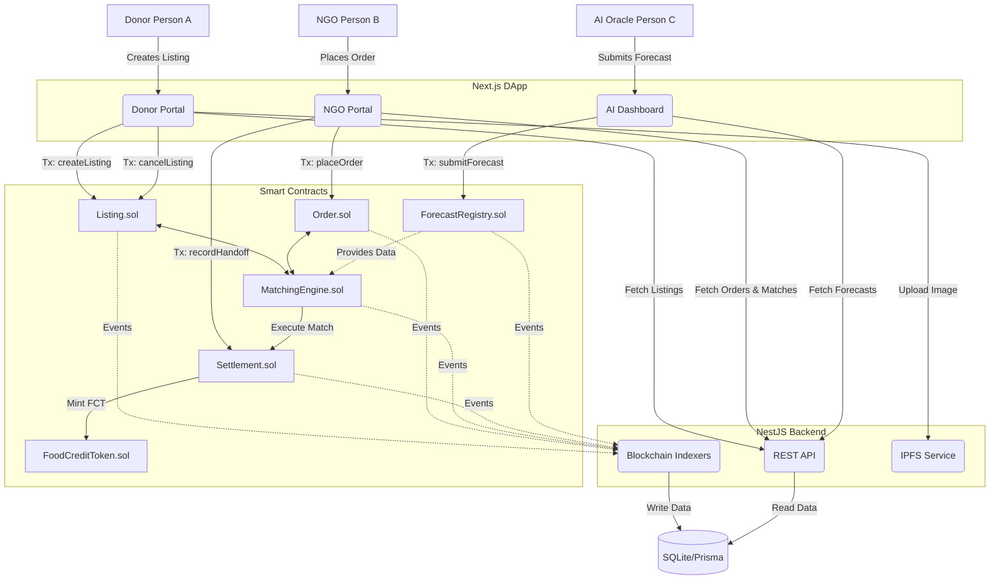

# FSE — Food Surplus Exchange Architecture

## High-Level Overview

FSE is a decentralized platform built on Polygon that connects food donors (restaurants, supermarkets) with NGOs to efficiently distribute surplus food and reduce waste. 

The system utilizes an AI-driven urgency scoring mechanism to prioritize food matching based on perishability, location, and predicted demand. Donors are incentivized through Food Credit Tokens (FCT).

## Mermaid Architecture Diagram

## System Components

### 1. Smart Contracts
- **Listing.sol**: Manages food surplus listings.
- **Order.sol**: Manages NGO requests.
- **ForecastRegistry.sol**: Stores AI-generated food shortage predictions.
- **MatchingEngine.sol**: Uses a linear programming inspired off-chain or on-chain logic to match Listings to Orders based on an urgency score (Perishability + AI Forecast).
- **Settlement.sol**: Records custody handoffs (PickedUp -> InTransit -> Delivered) and mints tokens on delivery.
- **FoodCreditToken.sol**: ERC20 token minted to donors as a tax/carbon offset credit.

### 2. Backend (NestJS)
- **Indexers**: Listens to Polygon/Localhost events (e.g., `ListingCreated`, `MatchExecuted`) and syncs them to the SQLite database.
- **REST API**: Exposes cached, indexed data to the frontend for snappy UI loading.
- **Prisma ORM**: Manages SQLite.

### 3. Frontend (Next.js)
- Uses `wagmi` and `RainbowKit` for Web3 connection.
- Communicates directly with the blockchain for WRITE operations.
- Communicates with the NestJS backend for READ operations.
